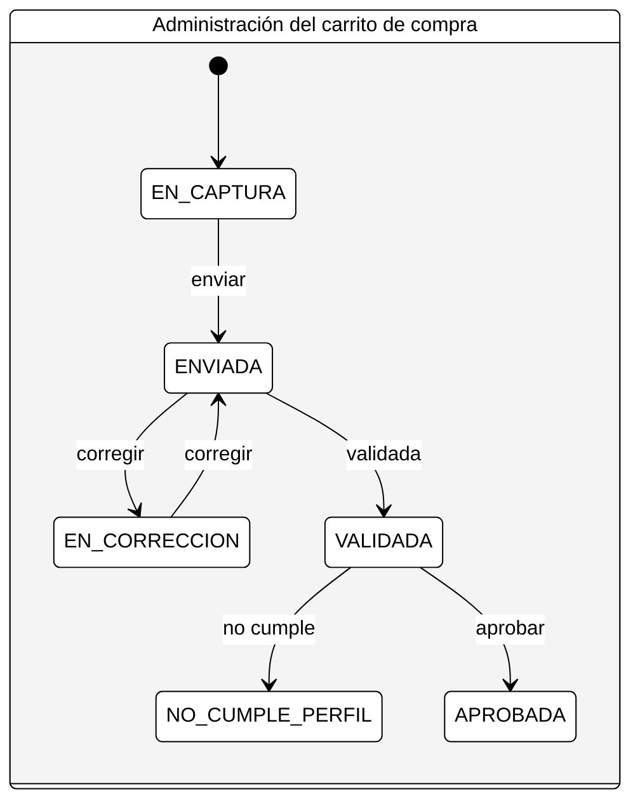

# 📚 Especificación de Requerimientos: Módulo de Gestión de Solicitudes de Apoyos (Cursos y Certificaciones)

## 🎯 Objetivo

El objetivo principal de este sistema es gestionar de manera eficiente y transparente el ciclo de vida completo de las solicitudes de apoyo gubernamental, específicamente para la participación en **Cursos y Certificaciones Técnicas**. El sistema debe asegurar que solo los aspirantes que cumplen con los requisitos documentales y el perfil técnico adecuado sean considerados para la aprobación final, respetando las capacidades limitadas de cada curso.

---

## 🧑‍💻 Perfiles y Actores del Sistema

| **Actor**                             | **Descripción**                                                                                      | **Responsabilidades Clave**                                                    |
| ------------------------------------- | ---------------------------------------------------------------------------------------------------- | ------------------------------------------------------------------------------ |
| **Aspirante**                         | Persona que busca inscribirse en un Apoyo (Curso o Certificación).                                   | Crear, llenar y enviar su Solicitud.                                           |
| **Operador de Validación Documental** | Personal encargado de revisar que la documentación sea completa y válida.                            | Revisar y cambiar el estado de la Solicitud a `EN_CORRECCION` o `VALIDADA`.    |
| **Evaluador Técnico**                 | Personal experto encargado de revisar la pertinencia del perfil del Aspirante con respecto al Curso. | Revisar y cambiar el estado de la Solicitud a `NO_CUMPLE_PERFIL` o `APROBADA`. |
| **Administrador del Sistema**         | Personal encargado de la carga y mantenimiento de los catálogos de Apoyos (Cursos).                  | Cargar, editar y dar de baja Apoyos.                                           |

---

## 💾 Catálogo de Datos Maestros: Apoyos (Cursos)

El sistema debe mantener un catálogo de **Apoyos** (Cursos/Certificaciones) predefinidos que los aspirantes pueden seleccionar.

| **Campo**        | **Descripción**                                                          | **Tipo de Dato**   | **Requerido** |
| ---------------- | ------------------------------------------------------------------------ | ------------------ | ------------- |
| `id`             | Identificador único del curso.                                           | Alfanumérico (PK)  | Sí            |
| `nombre`         | Nombre completo del curso (Ej: "Introducción a Machine Learning").       | Cadena             | Sí            |
| `desc`           | Descripción detallada del temario y alcance del curso.                   | Texto largo        | Sí            |
| `prerrequisitos` | Requisitos técnicos y/o académicos que el aspirante debe cumplir.        | Texto largo        | Sí            |
| `keywords`       | Palabras clave para la búsqueda e identificación del curso.              | Arreglo de Cadenas | Sí            |
| `tipo`           | Tipo de apoyo. **Valor fijo: `CURSO`**.                                  | Cadena             | Sí            |
| `capacidad`      | Número máximo de participantes. **Regla de Negocio: Máximo 10 lugares.** | Entero             | Sí            |

---

## 📝 Objeto Central: Solicitud de Apoyo

Este objeto encapsula toda la información del aspirante y su proceso.

### A. Estructura de la Solicitud

| **Campo**                                     | **Descripción**                                                          | **Tipo de Dato**   | **Restricciones / Notas**                      |
| --------------------------------------------- | ------------------------------------------------------------------------ | ------------------ | ---------------------------------------------- |
| `curp`                                        | Clave Única de Registro de Población.                                    | Alfanumérico       | **Único** por persona (Regla 4).               |
| `nombre`, `primerApellido`, `segundoApellido` | Datos de identificación del aspirante.                                   | Cadenas            | Todos requeridos (Regla 1).                    |
| `genero`                                      | Género del aspirante.                                                    | Cadena             |                                                |
| `desc`                                        | Descripción de su trayectoria y experiencia técnica (CV resumido).       | Texto largo        |                                                |
| `keywords`                                    | Palabras clave que caracterizan el perfil del aspirante.                 | Arreglo de Cadenas |                                                |
| `ineUrl`                                      | URL o referencia al documento INE digitalizado.                          | URL                | **Regla 2:** Debe ser un documento válido.     |
| `cvUrl`                                       | URL o referencia al CV completo en formato PDF.                          | URL                | **Regla 3:** Debe ser un documento válido.     |
| `apoyo`                                       | Nombre del curso seleccionado por el aspirante (referencia al catálogo). | Cadena             | Siempre debe existir en el catálogo de Apoyos. |
| `estado`                                      | **Estado actual del flujo de la solicitud.**                             | Enumeración        | Ver sección "Flujo de Estados".                |

### B. Flujo de Estados (Ciclo de Vida de la Solicitud)

| **Estado**         | **Descripción**                                                                                  | **Transición Permitida Por** |
| ------------------ | ------------------------------------------------------------------------------------------------ | ---------------------------- |
| `EN_CAPTURA`       | El Aspirante está creando o editando su solicitud.                                               | Aspirante                    |
| `ENVIADA`          | El Aspirante completó el llenado y la envió para revisión. **Inicio del Proceso de Validación.** | Aspirante                    |
| `EN_CORRECCION`    | El Operador detectó errores documentales (falta de campos, INE/CV inválidos).                    | Operador                     |
| `VALIDADA`         | La documentación y campos requeridos están correctos. **Inicio de la Evaluación Técnica.**       | Operador                     |
| `NO_CUMPLE_PERFIL` | El Evaluador determina que el perfil no es pertinente para el Curso seleccionado.                | Evaluador                    |
| `APROBADA`         | El Evaluador determina que el perfil cumple y la solicitud pasa a la fase de selección final.    | Evaluador                    |

#### 🔁 Diagrama de Transición de Estados de la Solicitud

La Solicitud atraviesa un ciclo de vida bien definido, donde solo actores específicos pueden provocar un cambio de estado.

### 📌 Explicación de las Transiciones

| **Estado Inicial** | **Evento / Acción**                                      | **Actor Responsable**   | **Estado Final**              | **Proceso Asociado**                 |
| ------------------ | -------------------------------------------------------- | ----------------------- | ----------------------------- | ------------------------------------ |
| **N/A**            | Creación de la Solicitud.                                | Aspirante               | **EN_CAPTURA**                | Inicio                               |
| **EN_CAPTURA**     | Envío de la Solicitud completa.                          | Aspirante               | **ENVIADA**                   | Finalización del llenado             |
| **ENVIADA**        | Validación Documental (Cumple **TODAS** las Reglas 1-4). | Operador                | **VALIDADA**                  | Aprobación Documental                |
| **ENVIADA**        | Validación Documental (Falla **ALGUNA** Regla 1-4).      | Operador                | **EN_CORRECCION**             | Solicitud de Aclaración              |
| **EN_CORRECCION**  | Aspirante corrige la Solicitud y la reenvía.             | Aspirante               | **ENVIADA**                   | Re-inicio de Validación              |
| **VALIDADA**       | Evaluación Técnica (Perfil **SÍ** pertinente).           | Evaluador               | **APROBADA**                  | Aprobación de Pertinencia            |
| **VALIDADA**       | Evaluación Técnica (Perfil **NO** pertinente).           | Evaluador               | **NO_CUMPLE_PERFIL**          | Rechazo por Incompatibilidad         |
| **APROBADA**       | Proceso de Selección Final (Fuera del Alcance Inicial).  | _Administrador/Sistema_ | **SELECCIONADA** _(Sugerido)_ | Asignación de cupo (Capacidad de 10) |

Este diagrama y tabla definen la **lógica de negocio** del sistema, asegurando que solo se realicen transiciones válidas por los actore

---

## 🏗️ Requerimientos Funcionales Detallados

### 1. Requerimiento: Creación y Envío de Solicitud (RF1)

- **Usuario:** Aspirante
- **Narrativa:** El Aspirante debe poder iniciar una nueva Solicitud, seleccionar un Apoyo (Curso) del catálogo, llenar todos los campos requeridos y adjuntar los documentos (`ineUrl`, `cvUrl`). Una vez lleno, debe poder cambiar el estado de la Solicitud de `EN_CAPTURA` a `ENVIADA`.

### 2. Requerimiento: Validación Documental (RF2)

- **Usuario:** Operador de Validación Documental
- **Precondición:** La Solicitud debe estar en estado `ENVIADA`.
- **Reglas de Validación (Hard Rules):**
  1. **Completitud de Campos:** Verificar que todos los campos de la Solicitud estén llenos (Regla 1).
  2. **Validez de Documentos:** Verificar la existencia y validez de los documentos referenciados en `ineUrl` y `cvUrl` (Reglas 2 y 3).
  3. **Unicidad de Solicitud:** Debe garantizarse que el `curp` no exista en otra Solicitud ya `ENVIADA`, `VALIDADA` o `APROBADA` (Regla 4).
- **Transiciones de Estado:**
  - Si **TODAS** las reglas se cumplen: El Operador cambia el estado a `VALIDADA`.
  - Si **ALGUNA** regla falla: El Operador cambia el estado a `EN_CORRECCION` y debe adjuntar una nota con los motivos de la corrección.

### 3. Requerimiento: Evaluación de Pertinencia Técnica (RF3)

- **Usuario:** Evaluador Técnico
- **Precondición:** La Solicitud debe estar en estado `VALIDADA`.
- **Regla de Pertinencia (Matching Rule):**
  1. **Alineación de Perfil:** El sistema debe proveer una herramienta (o el Evaluador debe juzgar) que la `desc`, `keywords` y el contenido del `cvUrl` de la Solicitud sean coherentes y cumplan con la `desc`, `prerrequisitos` y `keywords` del Apoyo (Curso) seleccionado (Regla 1 de Evaluación).
- **Transiciones de Estado:**
  - Si el perfil **NO** es pertinente: El Evaluador cambia el estado a `NO_CUMPLE_PERFIL`.
  - Si el perfil **SÍ** es pertinente: El Evaluador cambia el estado a `APROBADA`.

### 4. Requerimiento: Gestión de Capacidad y Selección (RF4)

- **Usuario:** Evaluador Técnico / Administrador
- **Precondición:** Solicitudes en estado `APROBADA`.
- **Regla de Capacidad:**
  1. Cada Apoyo (Curso) tiene una `capacidad` de 10 lugares (Regla 2 de Evaluación).
  2. El sistema debe permitir que el Evaluador **pondere/clasifique** las Solicitudes `APROBADAS` (por ejemplo, por _score_ o grado de alineación).
  3. El sistema debe permitir la **Selección Final**: Elegir y marcar a las 10 mejores Solicitudes por curso, que pasarán a un nuevo estado `SELECCIONADA` (este estado es sugerido para el cierre del proceso).
